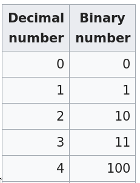
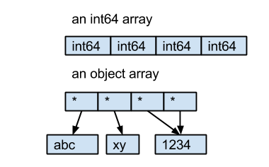

---
jupyter:
  jupytext:
    formats: ipynb,rmd//Rmd
    text_representation:
      extension: .Rmd
      format_name: rmarkdown
      format_version: '1.1'
      jupytext_version: 1.2.1
  kernelspec:
    display_name: Python 3
    language: python
    name: python3
---

Let's first create a markdown cell with a header. We can use the drop down menu in the tool bar or `m`, `y`, and `r` to switch between cell modes. Numbers switch between header levels.

# Setting up imports

- I usually add a few imports that I am sure I will use up front and then more as I go. If I do a lot of prototyping, I just add them in the cell I am currently working in and then move them to the first cell when I am ready to commit something.
- I usually open the object inspector on the side to get help with functions, but not for presentations because of screen real estate, instead I press `Shift+Tab` or use `?` to view docstrings.

```{python}
import seaborn as sns
import pandas as pd
import numpy as np
from sinfo import sinfo


sinfo() # Writes dependencies to `sinfo-requirements.txt` by default
```

# Pandas display options

There are many ways to get sample data to work with, including `sklearn.datasets`, `statsmodels.datasets` (includes all R datasets), and `quilt` (a package manager for data sets). More [details can be found in this SO answer](https://stackoverflow.com/a/29956221/2166823). For small examples, I tend to use `seaborn.load_dataset()` since I will import seaborn anyways (note these datasets are just there for the `seaborn` documentation and may change without notice).

```{python}
iris = sns.load_dataset('iris')
iris.head()
```

It is a little bit annoying to type `head()` every time I want to look at a dataframe. `pandas` has options to control the displayed data frame output and even a nice search interface to find them.

```{python}
pd.describe_option('row')
```

```{python}
pd.set_option('display.max_rows', 9)
```

We can see that this has changed the current value.

```{python}
pd.describe_option('max_row')
```

And if we type the `iris` now, we wont get flooded with 60 rows.

```{python}
iris
```

I like that this shows the beginning and the end of the data frame, as well as the dimensions (which would not show up with `head()`). The only drawback is that you need to set it back if you want to display more rows, or override it temporarily with the `pandas` options context manager.

To get the default back, we could use `pd.reset_option('max_row')`.


# Initial textual EDA


- Now that we have three headings, it can be good to check out the ToC extension. It allows us to see an overview of the document and to jump directly to specific code cell.
- Extensions like this can be installed via the command line or the new extension manager, which for now needs to be enabled in the advanced settings menu (but there will be a menu item in JL-1.0).
- Another useful extension is the spell-checking one which I have enabled, this is why some words show up in red background color.
- There is an extension that allows interactivity with `matplotlib`, for example panning and zooming.
- I also like the system-monitor topbar extension that shows how much RAM the current notebook is using and `nbdime` which shows Jupyter Notebook diffs formatted in a nice way without the json markup. The dark gruvbox theme I normally use is also available via an extension.


A good follow up from viewing the dataframe is to check if there are any `NaN` values and which data types pandas has identified (we already have a good idea from the above).

```{python}
iris.info()
```

We can see that there are no `NaN` values since every columns has the same number of non-null entries as the number of entries in the index (150). The data types and index type match up with what we might expect from glancing at the values previously. We can find out the number of unique values in each column via `nunique()`, which is useful to understand which variables are categorical.

```{python}
iris.nunique()
```

`describe()` shows descriptive summary statistics.

```{python}
iris.describe()
```

Note that describe by default only show numerical columns (if there are any), but we can specify that we want to include other column types.

```{python}
iris.describe(include='object')
```

We can also tell it to include all column and control the displayed percentiles.

```{python}
iris.describe(percentiles=[0.5], include='all')
```

As we saw, the default behavior for `describe()` is to include all numerical columns. If there are no numerical columns, `describe()` will instead show summary statistics for whichever columns are available.

```{python}
iris['species'].describe()
```

If there are many non-numerical columns, it can be tedious to write each one out. The `select_dtypes()` method can be used to get all column of a certain datatype.

```{python}
iris.select_dtypes('number').columns
```

```{python}
iris.select_dtypes('object').describe()
```

<!-- #region {"toc-hr-collapsed": false} -->
# Performance profiling 

Above we have seen three approaches to getting the summary statistics of the species column, so which one should we use? There are several factors leading into this decision, including code clarity, consistency, and performance (both memory and time). Assessing how long a chunk of code takes to run is referred to as profiling or benchmarking. We will walk through a couple of ways to do this in JupyterLab, but before we start it is important to note that code optimization should only be done when necessary, as once written by [Donald Knuth](http://wiki.c2.com/?PrematureOptimization):

> Programmers waste enormous amounts of time thinking about, or worrying about, the speed of noncritical parts of their programs, and these attempts at efficiency actually have a strong negative impact when debugging and maintenance are considered. We should forget about small efficiencies, say about 97% of the time: premature optimization is the root of all evil. Yet we should not pass up our opportunities in that critical 3%."

With that in mind, let's find out how we can profile code and find out if optimization is needed. For this example, we will compare the three `describe()` approaches above. These all run fast enough not to need optimization, but provide an instructive example for how to do profiling. With the magic functions `%timeit` and `%%timeit` we can time a line or an entire cell, respectively.
<!-- #endregion -->

```{python}
# %%timeit
iris.select_dtypes('object').describe()
```

```{python}
# %%timeit
iris.describe(include='object')
```

```{python}
# %%timeit
iris['species'].describe()
```

From this benchmarking, it is clear which approach is faster and which is slowest, but we do not have a clear idea why.

```{python}
# %%prun -l 7 -s cumulative # show the top 7 lines only
iris.select_dtypes('object').describe()
```

The names in parentheses indicates which function was called (`describe` is on row 3, the two before are general calls that will always be there) and the cumtime column is the cumulative time spent inside that function. This table has all the detailed timings, but it makes it difficult to get an overview of the call stack hierarchy, e.g. why was `select_dtypes()` called twice? To explore this further we can use `%%snakeviz` (this magic function comes from the third party module with the same name).

```{python}
# %load_ext snakeviz
```

```{python}
# %%snakeviz -t # -t is to open in new tab which is necessary in JupyterLab
iris.select_dtypes('object').describe()
```

In the graph, we can see the same information as with `%%prun`, but see which functions were called downstream of other functions. It is now clear that `select_dtypes()` was called once from within the `describe()` function in addition to us explicitly invoking the function.

```{python}
# %%snakeviz -t
iris.describe(include='object')
```

Here, there is only one invocation of `select_dtypes()` as expected.

```{python}
# %%snakeviz -t
iris['species'].describe()
```

Interestingly, we can see that this cell goes straight to the `describe_1d()` internal function, without having to call `select_dtypes()` and `concat()`, which saves a notable chunk of time.

Finally, we can inspect the source code to confirm the observed behavior. Any function method followed by `?` will show the docstring for that function and appending `??` will show the complete source code.

```{python}
iris.describe??
```

After a bit of argument checking and setting up helper functions, we get to the main part of the function. Here we can see that, if the dimensions of the input data i 1, it will directly return the output of `describe_1d()`, that is what happened when we passed the series. By default (when `include` and `exclude` both are `None`) it will use `select_dtypes()` to get all numerical columns and only use the original data frame if there were no numerical columns detected.

For long outputs or inputs it can be a good idea to collapse them to reduce the scrolling needed to navigate the notebook. This can be done by clicking the blue vertical bars to the left. Currently, collapsed input cells are still being executed, but in `JupyterLab` 1.0, they will be skipped. 

We now have a good intuition of what is happening when `describe()` is called on different input data.


# Pandas styling options

For HTML output, such as Jupyter Notebooks, dataframes can use the `style` attribute.

```{python}
iris.corr()
```

```{python}
iris.corr().style.set_precision(3)
```

Note that we only changed the precision of the *displayed* numbers. The actual values in the dataframe remain the same. The styling attribute can also change the color of the background and foreground of each cell, e.g. to highlight the max values.

```{python}
iris.corr().style.highlight_max()
```

It is also possible to create a heatmap.

```{python}
iris.corr().style.background_gradient()
```

The style methods are configurable via parameters just like other methods.

```{python}
iris.corr().style.background_gradient(cmap='Greens')
```

This might remind you of conditional formatting in spreadsheet software and the stylized output can actually be exported and opened in a spreadsheet program.

```{python}
iris.corr().style.background_gradient(cmap='Greens').to_excel('style-test.xlsx')
```

It is also possible to append the `render()` method to output the HTML, which can then be written to file. For detailed usage of `style`, please see [this SO answer](https://stackoverflow.com/questions/29432629/correlation-matrix-using-pandas/50703596#50703596) I provided previously and the [styling section of the pandas documentation](https://pandas.pydata.org/pandas-docs/stable/style.html).

<!-- #region {"toc-hr-collapsed": false} -->
# DataFrame aggregations

Aggregations can be specified in many different ways in pandas. From highly optimized built-in functions to highly flexible arbitrary functions. If the functionality you need is available as a DataFrame method, use it. These methods tend to have their most time consuming internals written in C and thus perform very well.
<!-- #endregion -->

```{python}
iris.mean()
```

`agg()` is a different interface to the built-in methods, which allows for multiple functions to be past in the same call.

```{python}
iris.agg('mean')
```

```{python}
iris.agg(['mean', 'median'])
```

If we want to use a function that is not available through `pandas`, we can use `apply()`.


While the built in aggregation methods automatically drop non-numerical values, `apply()` does not. Instead, an error is thrown with non-numerical cols.

```{python}
# Throws an error
#iris.apply(np.mean)
```

We could drop the string columns explicitly if there are just a few.

```{python}
iris.drop(columns='species').apply(np.mean)
```

If there are many, it is easier to use `.select_dtypes()`.

```{python}
iris_num = iris.select_dtypes('number')
iris_num.apply(np.mean)
```

## User-defined functions

### Named functions

`apply()` works with any function, including those you write yourself.

```{python}
def add_one(x):
    return x + 1

add_one(5)
```

```{python}
iris_num.apply(add_one)
```

```{python}
iris_num.apply(add_one) - iris_num
```

### Unnamed lambda functions

Lambda functions can be used without being named, so they are effective for throwaway functions that you are likely to use only once.

```{python}
(lambda x: x + 1)(5)
```

Lambda functions can be assigned to a variable name if so desired. This looks more like the standard syntax for a function definition, but lambda functions are rarely used like this.

```{python}
my_lam = lambda x: x + 1

my_lam(5)
```

Just as with named functions, there is nothing special with the letter `x`, it is just a variable name and you can call it whatever you prefer.

```{python}
(lambda a_descriptive_name: a_descriptive_name + 1)(5)
```

Unnamed lambda functions can be used together with apply to create any transformation to the dataframe values.

```{python}
iris_num.apply(lambda x: x + 1)
```

We can check if they are correct by surrounding with parentheses and assert equality.

```{python}
iris_num.apply(lambda x: x + 1) == iris_num.apply(add_one)
```

```{python}
(iris_num.apply(lambda x: x + 1) == iris_num.apply(add_one)).all()
```

A better way to assert that two dataframes are equal is to use the `assert_frame_equal()` from `pandas.testing`.

```{python}
# This will throw a detailed error if the assert does not pass.
pd.testing.assert_frame_equal(
    iris_num.apply(lambda x: x + 1),
    iris_num.apply(add_one))
```

### Row and column wise aggregations

By default, aggregation methods are applied column-wise (along the 0th axis), but can be set to work row-wise instead.

```{python}
# The row with the highest value in for each column.
iris_num.idxmax()  # Same as axis=0
```

```{python}
# The column with the highest value in for each row.
iris_num.idxmax(axis=1)
```

Sepal length seems to be the highest value for all rows,which we can confirm with `value_counts()`.

```{python}
iris_num.idxmax(axis=1).value_counts()
```

Be careful when using apply to iterate over rows. This operation is very inefficient and there is often another simpler solution that takes advantage of the optimized pandas functions to create significant speedups.

```{python}
# %%timeit
iris.apply(lambda x: x['sepal_length'] + x['sepal_width'], axis=1)
```

```{python}
# %%timeit
iris['sepal_length'] + iris['sepal_width']
```

```{python}
# Test if apply and column addition gives the same result
pd.testing.assert_series_equal(
    iris.apply(lambda x: x['sepal_length'] + x['sepal_width'], axis=1),
    iris['sepal_length'] + iris['sepal_width'])
```

<!-- #region {"toc-hr-collapsed": true} -->
# Working with categories

For this we will work with the titanic dataset from kaggle. It can be downloaded from their site or via different github users who have mirrored the data in their repos.
<!-- #endregion -->

```{python}
titanic = pd.read_csv('https://raw.githubusercontent.com/agconti/kaggle-titanic/master/data/train.csv')
# Convert column names to lower case, more on `str` later
titanic.columns = titanic.columns.str.lower()
# Change pclass values for clarity
titanic['pclass'] = titanic['pclass'].map({1: '1st', 2: '2nd', 3: '3rd'})
# Drop columns that we won't use
titanic = titanic.drop(columns=['passengerid', 'sibsp', 'parch', 'ticket', 'fare', 'cabin', 'embarked'])
titanic
```

```{python}
titanic.info()
```

How should we interpret the `+` sign under memory usage? In the docstring for `info()`, there is one option that affects memory usage, let's try it.

```{python}
titanic.info(memory_usage='deep')
```

What happened? Why is the memory usage listed as around six times what we saw previously? The `info()` method's docstring explains why:

> Without deep introspection a memory estimation is made based in column dtype and number of rows assuming values consume the same memory amount for corresponding dtypes. With deep memory introspection, a real memory usage calculation is performed at the cost of computational resources.

So deep memory introspection shows the real memory usage, but it is still a bit cryptic what part of the dataframe's size was hidden previously. To find this out, it is helpful to understand that `pandas` dataframes essentially consist of `numpy` arrays held together with the `pandas` dataframe block manager. Knowing that, it would be interesting to inspect whether any of the columns (the separate `numpy` arrays) report different size measures with and without deep memory introspection. Instead of the more general `info()` method, we can use the more specific `memory_usage()` method to find this out.

```{python}
titanic.memory_usage()
```

```{python}
titanic.memory_usage(deep=True)
```

From this, it is clear that it is the `name`, `sex`, and `pclass` columns that change, everything else remains the same. To understand what is happening, we first need to know that a `numpy` array is stored in the computer's memory as a contiguous (uninterrupted) segment. This is one of the reasons why `numpy` is so fast, it only needs to find the start of the array and then access a sequential length from the start point instead of trying to look up every single object (which is how a lists work in Python). This is well illustrated in the figure below from the Python Data Science Handbook.


[Image source](https://jakevdp.github.io/PythonDataScienceHandbook/02.01-understanding-data-types.html)


In order for `numpy` to store objects contiguously in memory, it needs to allocate the same fixed number of bits for each object in the array. For example, to store a binary value, only one bit would be required which can be either zero or one. To store integers, it is however many bits are needed to count up to that integer, e.g. two bits for the number 3 (`11` in binary), three bits for the number 4 (`100` in binary). By default, `numpy` will store integer values in arrays as the 64-bit integer data type, which accommodates values up to $2^{64}$ (around $18*10^{18}$).



[Image source](https://en.wikipedia.org/wiki/Binary-coded_decimal)


This is fine for integers (up to a certain size) or floats (up to a certain precision), but with strings of variable length (and more complex object such as lists and dictionaries), `numpy` cannot fit them into the fixed sized chunks in an effective manner (strings of fixed length would technically work fine) and the actual string object is stored outside the array. So what is inside the array? Just a reference (also called a pointer) to where in memory the actual object is stored and these references are of a fixed size:



[Image source](https://stackoverflow.com/questions/21018654/strings-in-a-dataframe-but-dtype-is-object/21020411#21020411)


When we indicate that we want to use the deep memory introspection, `pandas` finds and calculates the size of each of the objects that the array references point to. With the shallow introspection, it simply reports the memory consumption of the references that are actually stored in the array (and by default these are the same 64-bit size as the default for the integers and floats). 

Note that memory usage is not the same as disk usage. Objects can take up additional space in memory depending on how they are constructed.

```{python}
titanic.to_csv('titanic.csv', index=False)
# !ls -lh titanic.csv
```

For columns with a unique string for each row, there is currently no way around storing these as the object dtype. This is the case for the `name` column in the titanic dataset. However, columns with repeating strings can preferentially be treated as categoricals, which both reduces memory usage and enables additional functionality. For example, for the `sex` column, it is inefficient to store `'Male'` and `'Female'` for each row, especially taking into account the memory storage limitations mentioned above. Instead, it would be beneficial to store and integer for each row, and then have a separate dictionary that translates these integer into their respective strings (which are only stored once).

`Categorical` can be used to convert a string-based object column into categorical values.

```{python}
pd.Categorical(titanic['sex'])
```

```{python}
titanic['sex'] = pd.Categorical(titanic['sex'])
```

```{python}
titanic.dtypes
```

The dtype has now changed to `category`.

```{python}
titanic.memory_usage(deep=True)
```

The `sex` column takes up 50x less space in memory after being converted to a categorical dtype. It actually even takes up less space than the other integer columns, how is that possible? The answer is that when storing integers, `pandas` by default uses 64-bit precision to allow for large numbers to be stored (and added to the dataframe without making a new copy). When creating the categorical series, `pandas` uses the lowest needed precision (`int8` in this case) since it is unlikely that so many new categories will be added that this storage format reaches its limitation (which for `int8` is 256 values).

```{python}
titanic['sex'].cat.codes
```

Note that if we try to store an object with unique strings as a category, we actually *increase* the memory usage, because we are still storing all the unique strings once in the dictionary, and on top of that we have added a unique number for each string.

```{python}
titanic['cat_name'] = pd.Categorical(titanic['name'])
titanic.memory_usage(deep=True)
```

In addition to memory savings, categories are beneficial for certain types of operations. In the titanic dataset, there are a few more variables that does not have the correct data type.

```{python}
titanic
```

`survived` and `pclass` are not numerical variables, they are categorical. `survived` can be stored as a boolean variable, which takes exactly one byte per row.

```{python}
titanic['survived'] = titanic['survived'].astype('bool')
titanic.memory_usage(deep=True)
```

Survived is stored as `int8` and is exactly 1/8th of the integer columns since there is no overhead from storing the categorical mapping dictionary.

```{python}
7128 / 891
```

`pclass` is an ordered categorical, where first class is the highest class and third class is the lowest. Note that this is not the same as a numerical, e.g. it is non-sensical to say that second class is double first class.

```{python}
pd.Categorical(titanic['pclass'], categories=['3rd', '2nd', '1st'], ordered=True)
```

```{python}
titanic['pclass'] = pd.Categorical(titanic['pclass'], categories=['3rd', '2nd', '1st'], ordered=True)
```

With an ordered categorical, comparisons can be made. We can get everything that is higher than third class.

```{python}
# Note that comparisons with string also work, but it is just comparing alphabetical order.
titanic['pclass'][titanic['pclass'] > '3rd'].value_counts()
```

The order is also respected by pandas and seaborn, such as in the sort performed by default in groupby.

```{python}
titanic.groupby('pclass').size()
```

```{python}
titanic.groupby('pclass').describe()
```

For methods that don't sort, this will not be in order, e.g. `groupby.head()`.

```{python}
titanic.groupby('pclass').head(2)
```

`values_counts()` sorts based on value, not index.

```{python}
titanic['pclass'].value_counts(normalize=True)
```

Which we can see if we profile it.

```{python}
# %%prun -l 5
titanic['pclass'].value_counts(normalize=True)
```

seaborn will also sort the values according to the categorical order from left to right.

```{python}
sns.catplot(x='pclass', y='age', data=titanic, kind='swarm')
```

When `catplot()` was added for categorical plots, the `seaborn` author also added another human companion plot as an easter egg.

```{python}
sns.dogplot()
```

<!-- #region {"toc-hr-collapsed": false} -->
# Working with strings
<!-- #endregion -->

As a general purpose programming language, Python has many powerful built-in string methods that can be accessed from any string object.

```{python}
'First Last'.lower()
```

We could use these with dataframes, via `apply()`.

```{python}
titanic['name'].apply(lambda x: x.lower())
```

However, `pandas` has a built-in accessor attribute, which gives access to these string methods (and some special ones) in a more convenient syntax.

```{python}
titanic['name'].str.lower()
```

Note that these work on Series, not dataframes. So either use on one series at a time or a dataframe with a lambda experssion.


## What are the longest lastnames in the titanic datasets?

To find this out, we need to split first and last names from the `name` column.

```{python}
titanic['name'].str.split(',')
```

That return a series of lists holding the first and last name. By specifying `expand=True`, the list will expand into two separate columns.

```{python}
titanic['name'].str.split(',', expand=True)
```

Another way of doing this is with `partition()` which expands by default. However, it also includes the separator in its own column, so it is not ideal for our purposes here, but we will be using it later.

```{python}
titanic['name'].str.partition(',')
```

The output can be assigned to multiple columns.

```{python}
titanic[['lastname', 'firstname']] = titanic['name'].str.split(',', expand=True)
titanic
```

The `len()` method gives the length of each string.

```{python}
titanic['lastname_length'] = titanic['lastname'].str.len()
titanic
```

We can see if it worked by looking at the top few values.

```{python}
titanic.sort_values('lastname_length', ascending=False).head()
```

A shortcut for sorting, that also performs better, is to use `nlargest()`.

```{python}
titanic.nlargest(5, 'lastname_length')
```

```{python}
sns.distplot(titanic['lastname_length'], bins=20)
```

`pandas` also includes useful method to answer how many people have the same lastname.

```{python}
titanic['lastname'].value_counts()
```

Nine people are named `'Andersson'`.

```{python}
titanic['lastname'].value_counts().value_counts()
```

The most common scenario is that only one person has any given last name, but overall there are more than 100 people that share last name with someone else. With `duplicated()` we can view all the entries for people sharing last names.

```{python}
titanic[titanic.duplicated('lastname', keep=False)].sort_values(['lastname'])
```

It seems like lastname duplication can be due to female passengers being registered under their husbands lastname. To get an idea of how many occurrences there of female passengers with the title `Mrs.` and a parenthesis in their last name (indicating another maiden name), we can use the `str.contains` method. Let's start with just the parenthesis.

```{python}
titanic.loc[titanic['name'].str.contains('\('), 'sex'].value_counts()
```

It is mostly female passengers who have a parentheses in the name.

## Multi-line method chaining

Before we proceed, a note about multiline-method chaining in `pandas`. Method chaining is when multiple methods are appended after each other like we did in the cell above. This can be done in one line, but often it is preferential to spread it out over multiple lines.

Multi-line statements can be formatted in a few different ways in Python, e.g. we could use the explicit line continuation character `\` for a syntax similar to how R uses `%>%`.

```{python}
titanic \
    .loc[titanic['name'].str.contains('\('), 'sex'] \
    .value_counts()
```

This is perfectly fine according to the style guides and readable so feel free to use this style if it is easy to remember due it's similarity to pipes in `dplyr`. More common in Python is to use implicit line continuation with an open `(` to indicate the line continues below.

```{python}
(titanic
    .loc[titanic['name'].str.contains('\('), 'sex']
    .value_counts())
```

One of the advantages here is that we don't have to remember to put a continuation character on each lines when we add new lines. The closing `)` could also be put a new line for maximal flexibility.

To find out how many passengers do not have a `(` in their name, we can use the `~` operator to negate (or invert) the boolean expression generated with `contains()`. 

```{python}
(titanic
    .loc[~titanic['name'].str.contains('\('), 'sex']
    .value_counts())
```

```{python}
# `value_counts()` can also create normalized counts.
(titanic
    .loc[titanic['name'].str.contains('\('), 'sex']
    .value_counts(normalize=True))
```

Note that in the above examples we have selected both the rows and the columns by separating them with a comma within a single call to `loc[]`. It is important to select them this way rather than using multiple chained calls or selecting columns with `[]` afterwards, since these approaches might give you a `SettingWithCopyWarning` when trying to modify these dataframe subsets. The reason for this is that `pandas` does not know if you are operating on a new (copy) dataframe or trying to change values within the original data frame.


There seems to be several reasons for parenthesis in the name. The ones we want to change are the ones who have 'Mrs' and a parenthesis in the name. To combine boolean expression we can surround each one with `()` and then use the bitwise comparison operators: `&` for "and", `|` for "or".  These compare each row for the two separate boolean expressions and outputs a single boolean matrix.

```{python}
(titanic
    .loc[(titanic['name'].str.contains('\('))
        & (titanic['name'].str.contains('Mrs'))
        , 'sex']  # On a separate row for clarity
    .value_counts())
```

Dropped all male and 4 female passengers. Which females were dropped?

```{python}
(titanic
    .loc[(titanic['name'].str.contains('\('))
        & (~titanic['name'].str.contains('Mrs'))
        & (titanic['sex'] == 'female')
        , 'name'])
```

Even more precisely, we only want to keep the ones with a last and first name in the parentheses. We can use the fact that these seems to be separated by a space. `contains` accepts regular expression, and we will use `.*` which means "match any characters", similar to how wildcards work in the Unix shell.

```{python}
# Explain regex above
# titanic.loc[(titanic['name'].str.contains('\(')) & (titanic['sex'] == 'female'), 'sex'].value_counts()
(titanic
    .loc[titanic['name'].str.contains('Mrs.*\(.* .*\)'), 'sex']
    .value_counts())
```

From these passengers, we can extract the name in the parenthesis using `partition`, which we saw previously.

```{python}
(titanic
    .loc[titanic['name'].str.contains('Mrs.*\(.* .*\)'), 'name']
    .str.partition('(')[2])
```

```{python}
(titanic
    .loc[titanic['name'].str.contains('Mrs.*\(.* .*\)'), 'name']
    .str.partition('(')[2]
    .str.partition(')')[0])
```

In this case I could also have used string indexing to strip the last character, but this would give us issues if there are spaces at the end.

```{python}
(titanic
    .loc[titanic['name'].str.contains('Mrs.*\(.* .*\)'), 'name']
    .str.partition('(')[2]
    .str[:-1]
)
```

There is a more advanced way of getting this with regex directly, using a matching group to find anything in the parenthesis.

```{python}
(titanic
    .loc[titanic['name'].str.contains('Mrs.*\(.* .*\)'), 'name']
    .str.extract("\((.+)\)"))
```

The two step partition method is perfectly fine, and regex can feel a bit magical sometime, but it is good to know about if you end up working a lot with strings or need to extract complicated patterns.

Now lets get just the last names from this column and assign them back to the dataframe.

```{python}
(titanic
    .loc[titanic['name'].str.contains('Mrs.*\(.* .*\)'), 'name']
    .str.partition('(')[2]
    .str.partition(')')[0]
    .str.rsplit(n=1, expand=True))
```

All the lastnames without parenthsis will remain the same and we will only overwrite those that match the criteria we set up above.

```{python}
titanic['real_last'] = titanic['lastname']
# Assign boolean to var name for clarity
mrs_paren = titanic['name'].str.contains('Mrs.*\(.* .*\)')

titanic.loc[mrs_paren, 'real_last'] = (titanic
    .loc[mrs_paren, 'name']
    .str.partition('(')[2]
    .str.partition(')')[0]
    .str.rsplit(n=1, expand=True)[1])
```

```{python}
titanic
```

This seems to have worked as we expected, passengers with "Mrs" in their name have a new value under `real_last`, but others don't.

```{python}
titanic['lastname'].value_counts().value_counts()
```

```{python}
titanic['real_last'].value_counts().value_counts()
```

The value counts also changed slightly. Note that this comparison is not ideal, since female passengers who got updated with a new lastname might still share that lastname with some other passengers on the boat.

We can visualize the results with a paired barplot of counts.

```{python}
titanic['real_last_length'] = titanic['real_last'].str.len()

titanic_long = (titanic
    .loc[titanic['sex'] == 'female']
    .melt(value_vars=['lastname_length', 'real_last_length']))
sns.catplot(x='value', hue='variable', data=titanic_long, kind='count')

titanic_long.groupby('variable').agg(['mean', 'median'])
```

# A few extras

```{python}
# Convert upper case column names to lower case and replace spaces with underscores
# import re
# titanic.rename(columns=lambda x: re.sub('(?!^)([A-Z]+)', r'_\1', x).lower())
```

```{python}
# Show all commands run this session, even from deleted cells
# #%hist
```

```{python}
# Grep through all commands from all sessions
# #%hist -g mrs_paren
```

```{python}
# For easier version control, this can be run in the last notebook cell (or use jupytext)
# # !jupyter-nbconvert mds-seminar-apply-cat-str.ipynb --to python
```

# A few EDA pointers

Some pointers on useful pandas and seaborn functions to conduct EDA on a new dataset. This is of course not the only way of doing EDA, so help yourself to what you find useful and leave the rest.

```{python}
import matplotlib.pyplot as plt
import seaborn as sns
import pandas as pd


# Personal preference, this is about the maximum amount of customization I think is needed for EDA
sns.set(context='notebook', style='ticks', font_scale=1.2,
        rc={'axes.spines.right': False, 'axes.spines.top': False})

titanic = pd.read_csv('../data/raw/titanic.csv', )
titanic.columns = titanic.columns.str.lower() # less shift clicking
```

`head()` is the most useful place to start to get a feel of what the data looks like.

```{python}
titanic.head()
```

`info()` is good for viewing data shape, missing values, and column data types.

```{python}
titanic.info()
```

`nunique()` displays the number of unique values for each column, which is useful to understand the structure of the data and for faceting and hueing later on.

```{python}
titanic.nunique()
```

`describe()` gives and idea of distribution shapes (although I usually think it's easier to see this in plots, but a quick peak can't hurt).

```{python}
titanic.describe()
```

The fastest way to view all univariate distributions is via the `hist()` method of pandas data frames.

```{python}
titanic.hist(figsize=(10,6), grid=False, bins=20)
plt.tight_layout()
```

Although some of these numerical variables are actually categorical, I would leave them in as numbers initially, just to eyeball if there are any obvious relationships to follow up on later.

`sns.pairplot()` shows the pair-wise variable relationships in addition to the single variable distributions. I tend to favor doing this directly instead of `hist()`, but both have their use cases. The pairplot grid can take quite some time to create for big data sets, so it can be a good idea to use `sample()` to only plot a subset of the data (but be sure to run it a few times to sample different subsets).

```{python}
sns.pairplot(titanic)
```

The `hue` parameter makes it straightforward to split by variables (variable choice can be guided by `nunique()` and/or the plot above).

```{python}
sns.pairplot(titanic, hue='survived')
```

It is good to keep in mind that the diagonal KDE-plots can be a bit misleading for discrete data (especially the categorical columns here). I might do a few more of these hue splits depending on how the data looks, potentially with fewer columns to create smaller plots.

Around this point I would encode the variables with what I believe is their correct data type to facilitate exploring them further.

```{python}
cols_to_cat = ['survived', 'pclass', 'sibsp', 'parch', 'embarked', 'sex']
titanic[cols_to_cat] = titanic[cols_to_cat].astype('category')
titanic = titanic.set_index('passengerid') # or drop this column
# `pd.cut()` can be used to change a numeric dtype into categorical bins
```

Now the pairplot is focused on the relationship between continuous variables.

```{python}
numeric_cols = titanic.select_dtypes('number').columns
sns.pairplot(titanic, hue='survived', vars=numeric_cols, plot_kws={'s':6, 'edgecolor':'none'})
```

Since the scatters are still saturated, I would probably want to investigate these two variables with separate 2D histograms or similar instead of different colors in the scatter plot.

*What I have done up until this point are what I tend to do most of the time. The below is more situational for me, so there might be better ways of going about it (such as rectangular area plots), but this approach is quick without any additional imports.*

To quickly gauge relationships between categorical and continuous variables, I would loop over the columns and subset the data. You could do some of this in a Facetgrid, but the melting steps are not easier than the loops in my opinion, and Facetgrids are really meant to display multiple subsets of the data by distributing variable values across columns and rows in the plot grid but keeping the x and y axes the same throughout. 

```{python}
cat_cols = titanic.select_dtypes('category').columns.to_list()
num_cols = len(cat_cols)
for numeric_col in numeric_cols.to_list():
    fig, axes = plt.subplots(1, num_cols, figsize=(num_cols * 3, 3), constrained_layout=True)
    for col, ax in zip(cat_cols, axes.flatten()):
        # I would prefer a swarmplot if there were less data points
        sns.violinplot(x=numeric_col, y=col, data=titanic, ax=ax, cut=0, scale='width')
        # I might add some sort of dotplot here, e.g. sns.stripplot or the fliers only from a boxplot
```

`sns.countplot()` can be used to show counts of categorical variables as barplots without the need for manually plotting `value_counts()`.

```{python}
fig, axes = plt.subplots(1, num_cols, figsize=(num_cols * 3, 3), constrained_layout=True)
for col, ax in zip(cat_cols, axes.flatten()):
    sns.countplot(x=col, data=titanic, ax=ax)#color='steelblue')
```

To understand relationships between the categorical variables, I would loop over the categorical columns and subset the data to count occurrences in the subsets. Again, you could do some of this in a Facetgrid, but it is a bit buggy for categorical counting since it is not its intended function.

```{python}
for hue_col in cat_cols:
    cat_cols_to_plot = [col for col in cat_cols if col != hue_col]
    num_cols = len(cat_cols_to_plot)
    fig, axes = plt.subplots(1, num_cols, figsize=(num_cols * 3, 3), constrained_layout=True)
    for col, ax in zip(cat_cols_to_plot, axes.flatten()):
        sns.countplot(x=col, data=titanic, ax=ax, hue=hue_col)
        # The below is optional
        if not ax == axes.flatten()[0]:
            ax.legend_.remove()
            ax.set_ylabel('')
```

The above could be made into one big subplot grid also, but it would involve a bit more verbose and EDA is ideally done without too much thinking about graphics layouts.


After this initial broad EDA, I would start more targeted EDA by using `sns.relplot` to explore relationships between two continuous variables and `sns.catplot` to explore relationships between a continuous and a categorical variable. Both of these plotting functions allow the use of small multiples (facets) to break the data into categorical subsets. The [seaborn tutorials](https://seaborn.pydata.org/tutorial.html) is a good place to learn more about this 
 I also created [this tutorial](https://nbviewer.jupyter.org/github/UofTCoders/2018-09-10-utoronto/blob/gh-pages/code/3-data-wrangling-and-viz.ipynb#Exploring-relationships-between-two-quantitative-variables) as part of UofTCoders.
